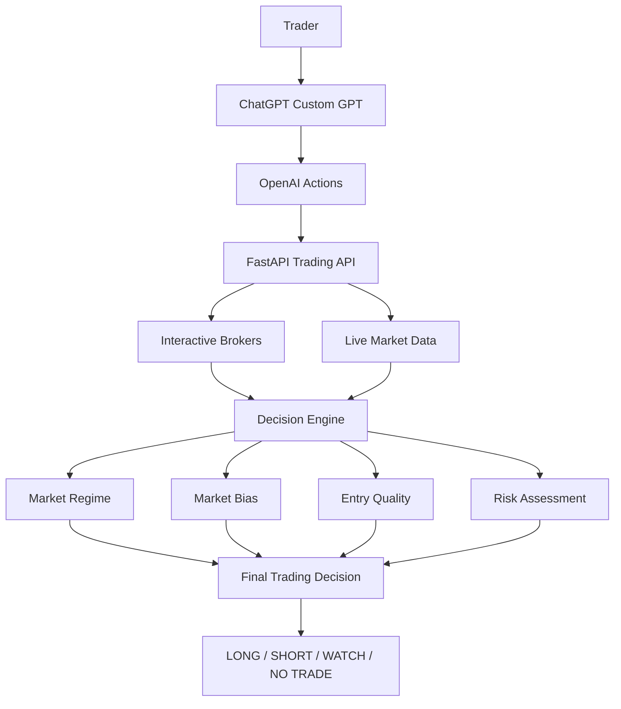

# AI Trading Decision OS

> An AI-powered decision operating system that helps traders evaluate market regime, market bias, entry quality, and risk using live market data and structured decision logic.

---

## Overview

AI Trading Decision OS is designed to help traders make disciplined, consistent decisions by evaluating market conditions before any trade is placed.

Unlike traditional trading assistants that primarily generate buy or sell signals, this system emphasizes capital preservation and decision quality. It separates market direction from trade quality, encouraging patience and structured analysis.

---

## Key Features

- Live market analysis
- Market Regime classification
- Market Bias assessment
- Entry Quality grading
- Broker-aware position management
- Capital-preservation-first workflow
- WAIT / NO TRADE recommendations
- Structured trade plans using live market data

---

## Architecture

## Technologies

- OpenAI Custom GPT
- OpenAI Actions
- FastAPI
- Python
- Interactive Brokers API
- Cloudflare Tunnel

---

## Design Philosophy

The objective is not to maximize the number of trades.

The objective is to maximize the quality of trading decisions.

Capital preservation comes before opportunity.

---

## Roadmap

- Enhanced multi-asset support
- Automated alerts
- Portfolio-level decision framework
- Additional strategy modules
- Performance journaling and analytics

---

## Disclaimer

This project is provided for educational and research purposes only.

It is not financial advice and should not be used as the sole basis for investment decisions.
