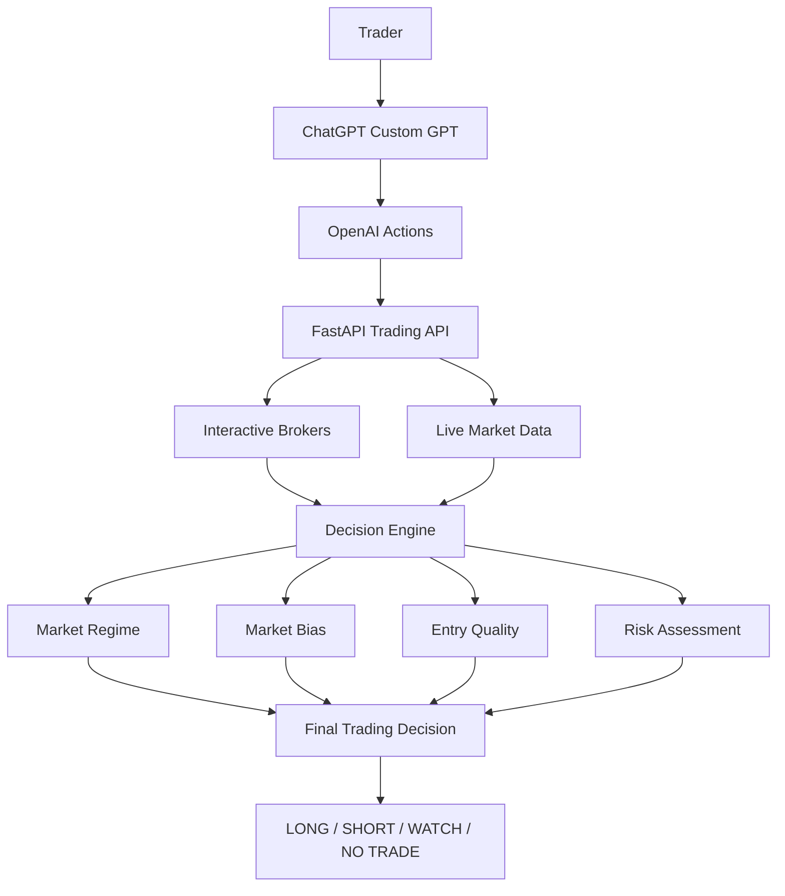

# AI Trading Decision OS

> An AI-powered decision operating system that helps traders evaluate market regime, market bias, entry quality, and risk using live market data and structured AI reasoning.

---

# Overview

AI Trading Decision OS is designed to help traders make disciplined, consistent decisions before placing a trade.

Rather than simply generating buy or sell signals, the system combines live market data, broker information, and structured AI reasoning to evaluate the quality of a trading opportunity. Its primary objective is to improve decision quality, reduce emotional trading, and preserve capital.

---

# Why This Project?

Most traders already have access to technical indicators.

The real challenge is combining dozens of signals into one consistent, repeatable decision while avoiding emotional bias.

AI Trading Decision OS was created to provide a structured decision workflow that evaluates market conditions before any trade is placed. Instead of encouraging more trades, it encourages better trades—or no trade at all when conditions are not favorable.

---

# Architecture

The trader interacts with a ChatGPT Custom GPT, which calls OpenAI Actions. Those actions connect to a FastAPI backend that combines Interactive Brokers account information with live market data to produce a structured trading decision.

---

# Key Features

- Live market analysis
- Market Regime classification
- Market Bias assessment
- Entry Quality grading
- Risk assessment
- Broker-aware position management
- Capital-preservation-first workflow
- WAIT / NO TRADE recommendations
- Structured trade plans using live market data

---

# Technologies

- OpenAI GPT-5.6
- OpenAI Custom GPT
- OpenAI Actions
- Codex
- Python
- FastAPI
- Interactive Brokers API
- Cloudflare Tunnel
- GitHub
- JSON

---

# Design Philosophy

The objective is **not** to maximize the number of trades.

The objective is to maximize the quality of trading decisions.

Capital preservation comes before opportunity.

A successful outcome may be a **WAIT / NO TRADE** recommendation when market conditions do not meet predefined quality standards.

---

# OpenAI Build Week

During OpenAI Build Week, this project was refined into a demonstration-ready AI trading decision system.

Work completed during Build Week included:

- refining the AI decision workflow
- improving structured decision outputs
- enhancing prompt engineering
- documenting the system architecture
- organizing the public repository
- preparing the live demonstration
- improving developer documentation

GPT-5.6 was used throughout the project for prompt engineering, structured reasoning, workflow design, documentation, implementation support, and refining the overall user experience.

Codex was used to assist with implementation planning, repository organization, code review, and documentation improvements during Build Week.

---

# Roadmap

Future development includes:

- Multi-asset support
- Automated trade alerts
- Portfolio-level decision framework
- Additional strategy modules
- Performance journaling and analytics

---

# Disclaimer

This project is provided for educational and research purposes only.

It does not provide financial advice and should not be used as the sole basis for investment decisions.
